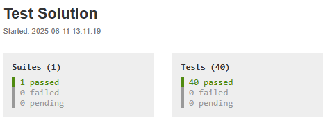
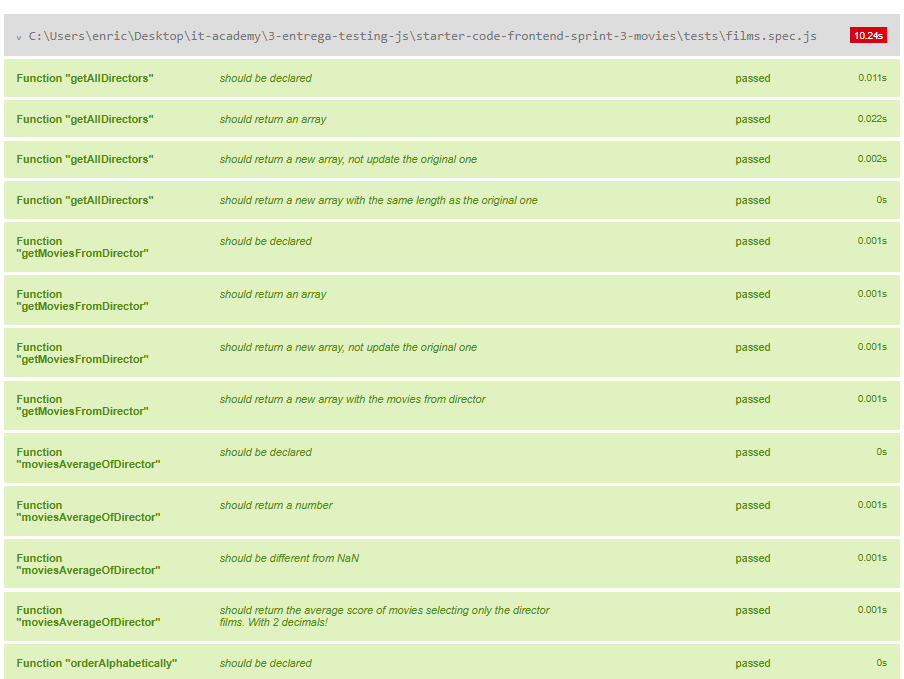

# Sprint 3 IT Academy | Video management tool

## Introduction

> **Duration:** 2 weeks  
> **Goal:** Implement filtering, sorting and metrics logic over a movie array using ES6.

---

## 📝 Overview

An audiovisual company needs a web application that allows its employees to quickly search and manage movies. In this sprint, you’ll build the **core logic** of the app, based on a static dataset of 250 movies. Although we’re not consuming an API yet, this front-end logic will serve as the foundation for future development.

<br>

🎯 Implementation Tasks
In src/films.js, write pure functions using only ES6 array methods:

filterByYear(year)

filterByDirector(director)

filterByGenre(genre)

sortByTitle(order) (asc/desc)

sortByRating(order)

calculateAverageDuration()

percentageByGenre()

…and any additional functions required by the tests.

Important: Do not use for/while loops. Only map, filter, reduce, and sort.

---

## 📂 Repository Structure

```bash
.
├── src
│   ├── data.js          # Array with 250 movie objects
│   └── films.js         # Where you’ll implement all logic
├── tests
│   └── films.spec.js    # Jest tests defining each function
├── package.json
└── README.md            # This file

<br>

## Requirements


1. Clone this repo
```bash
$ git clone https://github.com/IT-Academy-BCN/starter-code-frontend-sprint-3-movies
```

2. Unlink your repo from the itacademy repository
```bash
$ git remote rm origin
```

3. Link your repo to the repository you have to create in your github account
```bash
$ git remote add origin <your repo name!>
```

<br>

## Submission

1. Upon completion, run the following commands:

```bash
$ git add .
$ git commit -m "Sprint Solution"
$ git push origin master
```

2. Create Pull Request.

3. Upload the link to the virtual campus so that your mentor can correct it and give you feedback.


<br>

## Introduction

The statement of the exercise is available on the virtual campus.

<br>

## Tests!


```shell
$ npm install
$ npm run test:watch
```

And last, open the generated `test-results.html` file with the "Live Server" VSCode extension to see test results.

Apart from the statement, you will know exactly what you are asked to do by looking at the file `tests/films.spec.js`, all tests are already defined here!

<br>

## Instructions

You have the following indications from the frontend responsible:

- It is mandatory to implement all loops in ES6 (using map, reduce, filter and sort to manipulate arrays).

- As at the moment we don't consume data from a server using an API, we will work with data from the src/data.js archive. For the moment we will implement the logic using
an array of information about 250 movies.

- The implementation is about processing this array of movies, to display it as requested in each exercise.

- The logic to implement will be placed in the src/films.js file.

- You don't need to show the result of each function on the screen. Your goal is to pass the tests.  More information on how to program oriented to pass tests at the end of the document.

- Don't forget to include the capture of the test results in the virtual campus.

<br>

## Screenshoots



<br>




